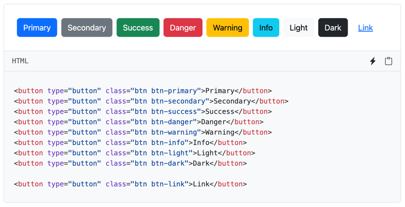
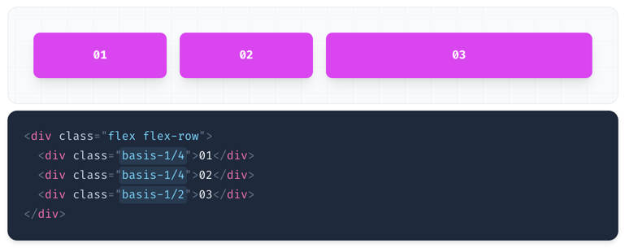

**[백엔드 개발자의 작은 일탈](https://whitepaek.com/posts/2024/01/backend-developer-departure/)** 포스트에서 말했듯이,
블로그를 새롭게 만들자는 목표를 이루기 위해서 개인적으로 가장 중요하게 생각한 부분은 제가 원하는 디자인의 화면을 개발하는 것이었어요. 원하는 디자인으로 개발하기 위해서는 CSS가 필수적이라고 생각을 했고,
앞서 공부한 바닐라 CSS(vanilla css)를 기반으로 화면 개발을 시작했어요.

하지만 바닐라 CSS로 헤더(header), 메인(main), 푸터(footer)를 구성하는 과정부터 원하는 대로 개발이 이뤄지지 않았고, 이론적으로 학습한 내용의 한계를 느꼈어요.
"백엔드 개발자로서 역시.. 나는 화면 개발에 전혀 맞지 않아!"라고 생각을 하면서 블로그 개발을 포기해야 하나 싶었어요.
그렇지만 나만의 블로그를 너무 가지고 싶었고, 직접 CSS를 사용하지 않고 원하는 디자인으로 개발하기 위해서 다른 분들의 블로그를 벤치마킹하기 시작했어요. (베낀 다음 조금 수정해서 쓸 목적으로요.)

그 과정에서 CSS 프레임워크(css frameworks)를 알게 되었고,
저는 유틸리티 프레임워크에서 많은 분들에게 사랑받고 있는 Tailwind CSS를 이용해서 블로그를 개발할 수 있었어요.

서론이 길었지만, 바닐라 CSS와 CSS 프레임워크 종류인 컴포넌트 프레임워크와 유틸리티 프레임워크에 대한 설명과 제가 유틸리티 프레임워크를 선택한 이유를 설명할게요. 
우선 CSS는 **바닐라 CSS**와 **CSS 프레임워크**로 나뉘고 있어요.

**바닐라 CSS** 개발의 장점은 **본인이 원하는 대로 `.css` 확장자 파일에 HTML 태그(tag), 클래스(class), 아이디(id) 정의로 원하는 디자인**을 개발할 수 있고, **사용하지 않는 불필요한 코드**를 제거할 수 있다는 것이에요.
그리고 **네이밍을 본인 스타일에 맞춰 정의**할 수 있어요. (제가 학습한 내용으로는 [BEM(Block Element Modifier)](https://getbem.com/introduction/) 규칙으로 정의해서 사용한다고 해요.)
단점으로는 본인이 작성한 코드가 **브라우저마다 잘 동작하는지 확인**해야 한다는 점과 **잘못된 정의로 인해 발생하는 버그**를 감수해야 해요.

```css
/* 태그 */
body {
    font-family: "Montserrat", sans-serif;
    margin: 0;
    padding-top: 3.5rem;
}

/* 클래스 */
.main-nav {
    display: none;
}

/* 아이디 */
#overview {
    height: 40vh;
}
```

**CSS 프레임워크**는 **컴포넌트 프레임워크**와 **유틸리티 프레임워크**로 나뉘어요.

**컴포넌트 프레임워크(component framework)** 는 대표적으로 [부트스트랩(Bootstrap)](https://getbootstrap.com/)이 있어요.
컴포넌트 프레임워크의 장점은 배지, 버튼, 리스트 등 컴포넌트가 개발되어 있기 때문에 공식 문서를 참고해서 **가이드에 따라 정의해서 사용**하면 돼요.
그리고 **대부분의 브라우저 지원을 고려**했고, **실행 속도도 빨라요.**



하지만 단점으로는 이미 정의되어 있는 **컴포넌트를 수정할 수가 없고, 가이드에 정의되어 있는 규칙을 파악**해야 해요. 그리고 사용하지 않는 컴포넌트 코드까지 전부 다운로드가 돼요.
가장 큰 단점으로는 정의되어 있는 컴포넌트를 사용하다 보니 **디자인이 비슷해 보일 수 있어요.**

**유틸리티 프레임워크(utility framework)** 는 대표적으로 [테일윈드 CSS(Tailwind CSS)](https://tailwindcss.com/)가 있어요.
유틸리티 프레임워크 장점은 **레이아웃과 유틸리티가 정의**되어 있기 때문에 공식 문서를 참고해서 **본인이 원하는 레이아웃과 디자인을 개발**할 수 있어요.
컴포넌트 프레임워크와 동일하게 **대부분의 브라우저 지원을 고려했기 때문에 호환이 잘 되고, 속도도 빨라요.**



단점으로는 **공식 문서에 정의되어 있는 가이드를 파악**해야 하고, 사용하지 않는 유틸리티 클래스가 전부 포함되어 있어요. 그리고 클래스에 많은 요소가 정의되기 때문에 코드가 길어져요.

바닐라 CSS, 컴포넌트 프레임워크 그리고 유틸리티 프레임워크의 장단점에 대해 설명했어요.

저는 이 중에서 유틸리티 프레임워크인 테일윈드 CSS를 선택한 이유는 바닐라 CSS 보다 러닝 커브가 적었으며, 컴포넌트 프레임워크랑 다르게 **원하는 디자인으로 CSS를 작업할 수 있었기 때문이에요.**
물론 테일윈드 CSS를 사용하기 위해서는 기본적인 바닐라 CSS의 동작 원리 이해가 필요하고, 공식 문서의 가이드도 익혀야 했어요.
하지만 화면 개발을 퍼블리셔가 전달해 준 코드에 대해 복사-붙여넣기 수준으로만 진행해 본 저는 CSS의 기본적인 동작 원리를 이해하고, 테일윈드 CSS 공식 문서 가이드를 익혔어도 제가 원하는 디자인의 개발은 쉽지 않았어요.

그래서 저는 [테일윈드 UI(tailwind ui)](https://tailwindui.com/components)에서 제공하는 컴포넌트를 활용하기로 결정했어요. 제공되는 컴포넌트를 접근하기 위해서는 $299 비용을 지불해야 해요.
저는 개인적으로 블로그 개발의 목표와 러닝 커브를 줄이기 위한 비용으로 합리적이라고 판단했어요. 또한 앞으로 제가 하는 일의 MVP(Minimum Viable Product) 개발에도 큰 도움이 될 수 있을 거란 기대감으로 비용 지출을 결정했어요.

물론 작은 비용이 아니라서 선뜻 지출하기에는 쉽지 않을 거예요.
테일윈드 컴포넌트를 활용해서 블로그를 만들고 학습한 입장에서 바닐라 CSS에서 "박스 모델, 요소 배치, Flex, Grid"의 동작 원리를 이해하면 테일윈드의 [공식 문서](https://tailwindcss.com/docs/installation)를 보면서 도전해 볼 수 있다고 판단했어요.

바닐라 CSS, 컴포넌트 프레임워크 그리고 유틸리티 프레임워크의 장단점을 고려해서 본인에게 적절한 방법을 선택하여 CSS 작업을 진행해 보세요.
계속 반복해서 하다 보면 언젠가는 익숙해지고, 자유자재로 CSS를 다룰 수 있는 날을 함께 기대해 보아요~!

> 러닝 커브(무언가를 습득하는데 드는 학습 비용)가 큰 순서는 **Vanilla CSS > Component Framework > Utility Framework** 로 일반적으로 이야기한다고 해요.

