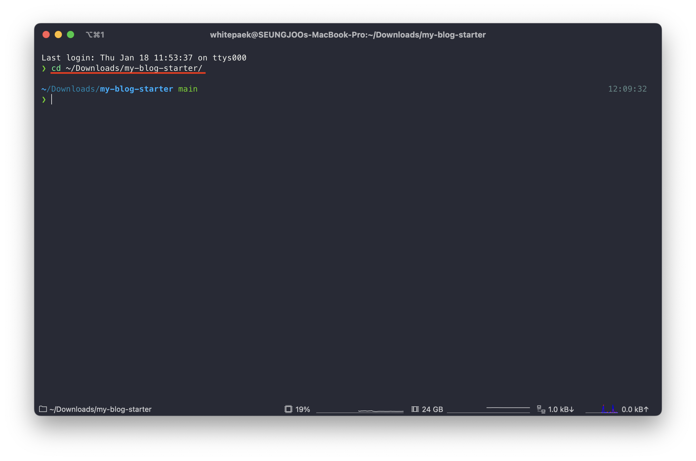

[개츠비(Gatsby) 블로그 기본 세팅](https://whitepaek.com/posts/2024/01/gatsby-blog-start-1/)을 완료했으면 [테일윈드 CSS(Tailwind CSS)를 적용](https://tailwindcss.com/docs/guides/gatsby)해 보도록 할게요.

이전 포스트에서 세팅한 블로그 디렉터리 위치로 이동해주세요.
```bash
$ cd ~/Downloads/my-blog-starter/
```


## 1. Tailwind CSS 의존성 설치
그리고 아래 명령어로 테일윈드 CSS 사용에 필요한 의존성을 설치해 주세요.
```bash
$ npm install -D tailwindcss postcss autoprefixer gatsby-plugin-postcss
```
![[1] Tailwind CSS 의존성 설치](./images/dependencies-install.png)

## 2. Tailwind CSS 설정 파일 생성
의존성 설치가 완료되었으면, 테일윈드 설정 파일을 아래 명령어로 생성해 주세요.
```bash
$ npx tailwindcss init -p
```
![[2] Tailwind CSS 설정 파일 생성](./images/init-tailwindcss.png)

## 3. Tailwind CSS 의존성, 설정 파일 세팅 결과 확인
테일윈드 CSS에 필요한 의존성 설치부터 설정 파일 생성까지 완료했다면,   
**package.json** 파일에 **"autoprefixer, gatsby-plugin-postcss, postcss, tailwindcss"** 의존성이 추가되고   
**postcss.config.js** 파일과 **tailwind.config.js** 파일이 생성된걸 볼 수 있어요.

![[3] Tailwind CSS 의존성, 설정 파일 세팅 결과](./images/added-tailwindcss-files.png)

기본적인 세팅은 완료했고, 이제부터 테일윈드 CSS 사용을 위해 설정을 진행할게요.

## 4. PostCSS 플러그인 추가
**gatsby-config.js** 파일을 열고 plugins 하위에 **gatsby-plugin-postcss**을 추가해주세요.
```text
`gatsby-plugin-postcss`,
```
![[4] gatsby-config.js 파일에 PostCSS 플러그인 추가](./images/added-dependency-postcss.png)

## 5. Tailwind CSS 사용을 위한 경로 설정
**tailwind.config.js** 파일을 열고 content 하위에 테일윈드 CSS를 적용할 페이지 경로를 추가해 주세요.
개츠비 블로그의 기본 디렉터리 구조에서는 **"components, pages, templates"** 하위에 페이지를 구성하기 때문에 3개의 디렉터리 경로를 추가해 주세요.
(디렉터리 구조를 변경 또는 추가 한다면 경로를 추가로 설정하면 돼요.)
```text
"./src/components/**/*.{js,jsx,ts,tsx}",
"./src/pages/**/*.{js,jsx,ts,tsx}",
"./src/templates/**/*.{js,jsx,ts,tsx}",
```
![[5] Tailwind CSS를 적용할 디렉터리 경로 설정](./images/added-tailwindcss-direcotry-path.png)

## 6. global.css 파일 생성
**src** 디렉터리 하위에 **styles** 디렉터리를 생성하고, **global.css** 파일을 생성해 주세요.
그리고 파일에 아래 내용을 작성해 주세요.
```css
@tailwind base;
@tailwind components;
@tailwind utilities;
```
![[6] global.css 생성](./images/added-global-css-.png)

## 7. global.css 파일 설정
**gatsby-browser.js** 파일에 global.css 파일을 import 해주세요.
```js
import './src/styles/global.css'
```
![[7] global.css import 설정](./images/import-global-css.png)

## 8. Tailwind CSS 문법 적용
테일윈드 CSS 사용을 위한 준비 과정이 전부 끝났어요.   
테일윈드 CSS가 잘 적용되는지 확인을 위해 테스트용 페이지를 생성해서 적용해 보도록 할게요.
저는 pages 디렉터리 하위에 **tailwindcss 디렉터리와 index.js 파일을 생성**하도록 할게요.
그리고 [테일윈드 UI 컴포넌트](https://tailwindui.com/components/marketing/feedback/404-pages)의 404 Pages 코드를 사용할게요.   
아래 코드를 복사해서 생성한 index.js 파일에 작성해 주세요.

```js
import * as React from "react"

const TailwindcssIndex = () => {
  return (
    <>
      <main className="grid min-h-full place-items-center bg-white px-6 py-24 sm:py-32 lg:px-8">
        <div className="text-center">
          <p className="text-base font-semibold text-indigo-600">404</p>
          <h1 className="mt-4 text-3xl font-bold tracking-tight text-gray-900 sm:text-5xl">Page not found</h1>
          <p className="mt-6 text-base leading-7 text-gray-600">Sorry, we couldn’t find the page you’re looking for.</p>
          <div className="mt-10 flex items-center justify-center gap-x-6">
            <a href="#"
               className="rounded-md bg-indigo-600 px-3.5 py-2.5 text-sm font-semibold text-white shadow-sm hover:bg-indigo-500 focus-visible:outline focus-visible:outline-2 focus-visible:outline-offset-2 focus-visible:outline-indigo-600">Go
              back home</a>
            <a href="#" className="text-sm font-semibold text-gray-900">Contact support <span
              aria-hidden="true">&rarr;</span></a>
          </div>
        </div>
      </main>
    </>
  )
}

export default TailwindcssIndex
```
![[8-1] Tailwind UI의 404 Pages 컴포넌트를 이용한 Tailwind CSS 적용 테스트](./images/tailwindcss-test.png)

코드 준비가 완료됐으면 개츠비 서버를 실행 후, `http://localhost:8000/tailwindcss/`로 접속하여 404 Pages 컴포넌트가 잘 나오는지 확인해 주세요.
```bash
$ cd ~/Downloads/my-blog-starter/
$ gatsby develop
```
![[8-2] Tailwind UI 404 Pages 컴포넌트 적용 확인](./images/404-pages-compoent.png)

개츠비(Gatsby) 블로그에 테일윈드 CSS(Tailwind CSS) 적용을 완료했어요!

테일윈드 CSS 문법은 [공식 문서](https://tailwindcss.com/docs/grid-template-columns)를 통해 확인하고 사용하면 돼요.
테일윈드 CSS를 사용하기 위해서는 [CSS 비교 (Vanilla CSS vs CSS Framework)](https://whitepaek.com/posts/2024/01/css-vanilla-component-utility/) 포스트에서 설명했듯,
바닐라 CSS(Vanilla CSS) 문법의 기본적인 동작 방식에 대한 이해와 테일윈드 CSS 문법을 학습해야 해요.
(테일윈드 UI 컴포넌트를 활용하면 학습에 도움이 될 수 있어요.)
- - -
이번 포스트를 끝내기 전에 **style.css** 파일과 **normalize.css** 파일은 어떻게 해야 하는지 궁금하실 거예요.

![[9] style.css, normalize.css 파일](./images/css-files.png)

테일윈드 CSS만 사용하실 거라면 style.css, normalize.css 파일을 삭제하고 gatsby-browser.js 파일에서 2개의 import를 제거하세요.
테일윈드 CSS 문법을 커스텀에서 사용하고 싶으면 [공식 문서](https://tailwindcss.com/docs/adding-custom-styles)를 참고해서 **tailwind.config.js 파일에 설정**하면 돼요.
그리고 클래스(class)를 직접 정의해서 사용하고 싶다면 global.css 파일에 추가하거나 또는 css 파일을 생성하여 작성 후 gatsby-browser.js 파일에 import 하면 돼요.

테일윈드 CSS를 사용하지 않고 본인이 직접 CSS를 작성하여 디자인하고 싶다면, 이번 포스트 설정은 따라 하지 않고 style.css 파일에 직접 코드를 작성해서 사용하면 돼요.

이상으로 **"개츠비(Gatsby) 블로그 만들기 2 - Tailwind CSS 적용"** 포스트는 끝낼게요!