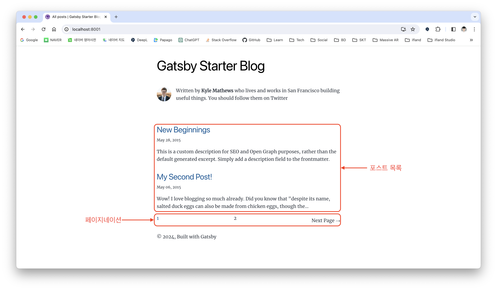

이전 포스트에서 세팅을 완료한 [개츠비(Gatsby) 블로그](https://whitepaek.com/posts/2024/01/gatsby-blog-start-1/)에 페이지네이션(pagination)을 알아보고, 적용해 보도록 할게요.

블로그를 열심히 운영한다면 적게는 수십 개에서 많게는 수백, 수천 개의 포스트가 생성될 거예요.
수많은 포스트를 불러오는 데 시간이 오래 걸릴 수 있고, 독자는 포스트를 찾는 경험이 나빠질 수 있어요.
이런 경우 페이징 처리를 적용하면 포스트를 분할해서 시간을 단축하고, 독자는 페이지 단위로 포스트를 찾을 수가 있어요.

페이징 처리는 페이지네이션(pagination), 인피니티 스크롤(infinite scroll) 방식이 있지만, 저는 [공식 문서를 참고하여 페이지네이션을 적용](https://www.gatsbyjs.com/docs/adding-pagination/)하도록 할게요.



## 1. blog-list.js 파일 생성
**./src/pages/** 디렉터리에 존재하는 **index.js** 파일을 **./src/templates/** 디렉터리 하위로 이동 후, **blog-list.js** 파일명으로 변경해 주세요.

![[1] "./src/pages/index.js -> ./src/templates/blog-list.js" 파일 변경](./images/move-index-file.png)

## 2. gatsby-node.js 파일에서 GraphQL Query 수정 및 페이지네이션 포스트 목록 코드 추가
gatsby-node.js 파일에서 **[2-1] 이미지**의 1번 영역(22 ~ 30번 라인)의 GraphQL 쿼리를 2번 영역의 쿼리로 수정해 주세요.
```js
// [2-1] 이미지의 2번 영역 코드
{
  allMarkdownRemark(sort: { frontmatter: { date: ASC } }, limit: 1000) {
    edges {
      node {
        id
        fields {
          slug
        }
      }
    }
  }
}
```
![[2-1] GraphQL Query 수정](./images/gatsby-node-graphql-query.png)

그리고 **[2-2] 이미지를 참고**하여 1번 코드를 2번 코드로 수정하고, 3번 코드를 4번 코드로 수정해 주세요.
```js
// [2-2] 이미지의 2번 영역 코드
const posts = result.data.allMarkdownRemark.edges

// [2-2] 이미지의 4번 영역 코드
createPage({
  path: post.node.fields.slug,
  component: blogPost,
  context: {
    id: post.node.id,
    previousPostId,
    nextPostId
  }
})
```

5번 영역의 코드처럼 페이지네이션을 적용한 포스트 목록 코드를 추가해 주세요.   
`postsPerPage` 변수는 포스트 목록에 보이는 포스트 개수이고, `numPages` 변수는 페이지네이션의 전체 페이지의 개수예요.   
개츠비 블로그에 포스트가 현재 3개 밖에 없기 때문에 포스트 목록에서 보이는 개수는 2개로 할게요.
그리고 현재 페이지는 URL에 path로 표현돼요. (e.g. 1페이지의 경우, 'localhost:8000/' 또는 3페이지의 경우, 'localhost:8000/3')   
```js
const postsPerPage = 2
const numPages = Math.ceil(posts.length / postsPerPage)

Array.from({ length: numPages }).forEach((_, i) => {
  createPage({
    path: i === 0 ? `/` : `/${i + 1}`,
    component: path.resolve("./src/templates/blog-list.js"),
    context: {
      limit: postsPerPage,
      skip: i * postsPerPage,
      numPages,
      currentPage: i + 1
    }
  })
})
```
![[2-2] Pagination 코드 추가](./images/added-pagination-code.png)

## 3. blog-list.js 파일에서 GraphQL Query 수정 및 Pagination 적용
blog-list.js 파일에서 73 ~ 94번 라인에 GraphQL을 `limit`, `skip` 추가된 쿼리로 수정해 주세요.
```js
export const pageQuery = graphql`
  query blogPageQuery($skip: Int!, $limit: Int!) {
    site {
      siteMetadata {
        title
      }
    }
    allMarkdownRemark(
      sort: { frontmatter: { date: DESC } }
      limit: $limit
      skip: $skip
     ) {
      nodes {
        excerpt
        fields {
          slug
        }
        frontmatter {
          date(formatString: "MMMM DD, YYYY")
          title
          description
        }
      }
    }
  }
`
```
![[3-1] limit, skip 추가된 GraphQL Query](./images/blog-list-graphql-query.png)

[3-2] 이미지를 참고하여 `{ data, location }` 코드를 `props`로 변경하고, 페이지네이션 적용에 필요한 변수를 정의해 주세요.
* `currentPage` : 현재 페이지
* `numPages` : 전체 페이지 개수
* `isFirst` : 현재 페이지가 첫 번째 페이지 여부
* `isLast` : 현재 페이지가 마지막 페이지 여부
* `prevPage` : 이전 페이지 번호
* `nextPage` : 다음 페이지 번호

```js
const location = props.location
const siteTitle = props.data.site.siteMetadata?.title || `Title`
const posts = props.data.allMarkdownRemark.nodes

const { currentPage, numPages } = props.pageContext
const isFirst = currentPage === 1
const isLast = currentPage === numPages
const prevPage = currentPage - 1 === 1 ? '/' : (currentPage - 1).toString()
const nextPage = (currentPage + 1).toString()
```
![[3-2] Pagination 적용에 필요한 변수 추가](./images/added-pagination-value.png)

페이지네이션 구현에 필요한 모든 준비는 끝났어요. 이제 페이지네이션 적용을 위해 정의한 변수를 활용해서 페이지네이션을 구현하면 돼요.
`isFrist`와 `prevPage` 변수를 활용해서 "← Previous Page"가 적용되고, `isLast`와 `nextPage` 변수를 활용해서 "Next Page →"가 적용될 거예요.
그리고 `numPages`와 `currentPage` 변수를 활용해서 페이지 번호가 보이도록 아래 코드를 참고해서 적용해 주세요.

```js
<ul style={{
  display: 'flex',
  flexWrap: 'wrap',
  justifyContent: 'space-between',
  alignItems: 'center',
  listStyle: 'none',
  padding: 0,
}}>
  
  {!isFirst && (
    <Link to={prevPage} rel="prev">
      ← Previous Page
    </Link>
  )}
  
  {Array.from({ length: numPages }, (_, i) => (
    <li key={`pagination-number${i + 1}`}>
      <Link to={`/${i === 0 ? '' : i + 1}`}
            style={{
              color: i + 1 === currentPage ? '#005B99' : ''
            }}
      >
        {i + 1}
      </Link>
    </li>
  ))}
  
  {!isLast && (
    <Link to={nextPage} rel="next">
      Next Page →
    </Link>
  )}
  
</ul>
```
![[3-3] Pagination 기능 구현](./images/pagination-code.png)

페이지네이션 적용을 완료했으면 기능 동작이 정상적으로 되는지 확인해 주세요.
![[3-4] Pagination 기능 동작](./images/pagination-test.png)

기본적인 페이지네이션 적용을 완료했어요. blog-list.js 파일에 구현한 페이지네이션 코드를 기반으로 본인이 원하는 페이징 동작을 구현하면 돼요.
`currentPage`, `numPage`, `isFrist`, `isLast`, `prevPage`, `nextPage` 변수 외에
**페이지네이션에 보이는 페이지 개수**와 **현재 페이지가 표시되는 위치**에 대한 변수를 추가로 정의하면 대부분의 페이징 동작을 만들 수 있을 거예요.
![[4] Pagination 예시](./images/pagination-example.png)

이상으로 공식 문서에서 제공해 주는 페이지네이션을 개츠비 블로그에 적용 완료했어요!