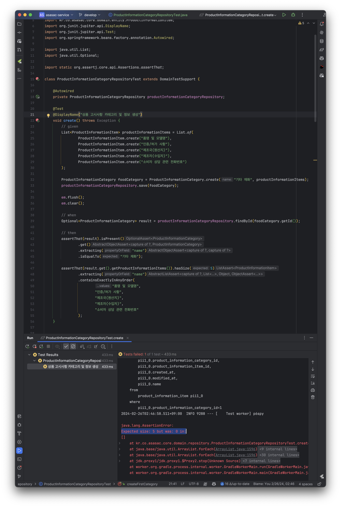
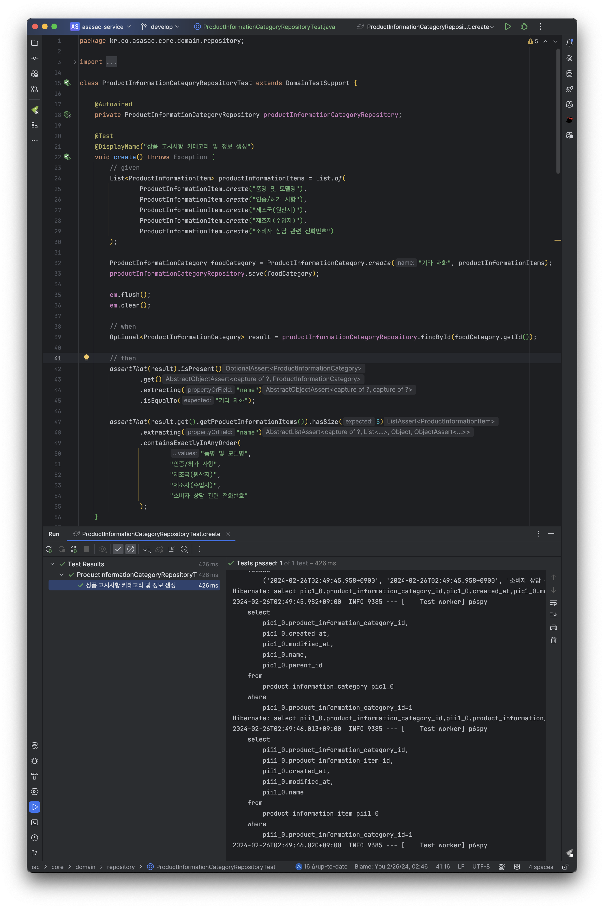

Spring Data JPA를 이용해서 엔티티(Entity) 설계를 진행하던 중 다대일(N:1) 또는 일대다(1:N) 관계의 테이블에 대한 엔티티 관계 매핑을 어떻게 해야 하는지 몰라서 학습을 진행했다.
학습한 내용을 정리하여 설명하겠다.

상품 고시정보를 관리하기 위해 상품 정보 카테고리(product_information_category)와 상품 정보 항목(product_information_item) 테이블을 생성했다.
product_information_category와 product_information_item 테이블은 일대다(1:N) 관계를 가진다. 즉, 1개의 상품 정보 카테고리는 여러 개의 정보 항목을 가진다.
(이번 글에서 product_information_category의 순환 관계에 대해서는 무시하도록 하겠다.)

![[1] 일대다(1:N) 테이블](./images/table.png)

상품 정보 카테고리와 상품 정보 항목 테이블 관계를 엔티티로 매핑하기 위해서는 @OneToMany와 @ManyToOne을 사용하면 된다.

product_information_item(상품 정보 항목) 기준에서 product_information_category(상품 정보 카테고리) 테이블과의 관계는 다대일(N:1)이다.
그러므로 productInformationItem 엔티티에서 `@ManyToOne`으로 ProductInformationCategory 엔티티와 다대일 관계로 매핑한다.

다대일 관계의 매핑은 다음과 같은 특징을 갖는다.
- 다대일 또는 일대다 관계에서는 항상 다(N)쪽이 연관관계의 주인으로 설정된다.
- `@ManyToOne`으로 설정된 엔티티는 영속 상태로 데이터 생성, 수정, 삭제를 진행할 수 있다.
- 다(N) 테이블에서는 연관관계 테이블의 ID를 필드로 가지고 있다. (product_information_item 테이블에서 product_information_category의 ID를 관리하고 있다.)

참고로 `@ManyToOne`에서 fetch 기본 타입은 즉시 로딩(eager)인 점을 주의하자.
즉시 로딩으로 사용하여 데이터를 조회하는 경우, 다(N) 관계 쪽에 있는 결과 데이터 만큼 데이터가 증가하기 때문에 성능에 큰 영향을 미치게 된다.
그러므로 `@ManyToOne`을 사용할 때는 **반드시 fetch 타입을 lazy로 설정**하도록 하자.

```java
@Entity
@Getter
@NoArgsConstructor(access = AccessLevel.PROTECTED)
public class ProductInformationItem extends BaseDateTimeEntity {

    @Id
    @GeneratedValue(strategy = GenerationType.IDENTITY)
    @Column(name = "product_information_item_id")
    private Long id;

    @ManyToOne(fetch = FetchType.LAZY)
    @JoinColumn(name = "product_information_category_id", nullable = false)
    private ProductInformationCategory productInformationCategory;

    @Column(nullable = false)
    private String name;

    // ... 중략
}
```

product_information_category(상품 정보 카테고리) 기준에서 product_information_item(상품 정보 항목) 테이블과의 관계는 일대다(1:N)이다.
그러므로 ProductInformationCategory 엔티티에서 `@OneToMany`로 productInformationItem 엔티티와 일대다 관계로 매핑한다.

일대다 관계의 매핑은 다음과 같은 특징을 갖는다.
- 다대일 또는 일대다 관계에서 일(1) 쪽은 연관관계 주인으로 설정하지 않기 때문에 `mappedBy = ""` 옵션을 설정한다.
- `@OneToMany(mappedBy = "")`로 설정된 엔티티의 필드는 영속 상태로 관리되지 않기 때문에 데이터 읽기만 진행할 수 있다. (데이터베이스에 생성, 수정, 삭제가 일어나지 않는다.)

```java
@Entity
@Getter
@NoArgsConstructor(access = AccessLevel.PROTECTED)
public class ProductInformationCategory extends BaseDateTimeEntity {

    @Id
    @GeneratedValue(strategy = GenerationType.IDENTITY)
    @Column(name = "product_information_category_id")
    private Long id;

    @Column(nullable = false)
    private String name;

    @ManyToOne(fetch = FetchType.LAZY)
    @JoinColumn(name = "parent_id")
    private ProductInformationCategory parent;

    @OneToMany(mappedBy = "parent")
    private List<ProductInformationCategory> children = new ArrayList<>();

    @OneToMany(mappedBy = "productInformationCategory")
    private List<ProductInformationItem> productInformationItems = new ArrayList<>();
    
    // ... 중략
}
```

엔티티 검증을 위해서 "'기타 재화' 상품 정보 카테고리와 기타 재화에 해당하는 상품 정보 항목 5개를 생성"하는 시나리오를 테스트 코드로 작성해서 실행했다.
상품 정보 카테고리(ProductInformationCategory) 엔티티에서 상품 정보 항목(productInformationItem)을 추가하여 생성했지만, 
상품 정보 카테고리(1) 엔티티에서 상품 정보 항목(N)은 영속 상태가 아니기 때문에 데이터 저장이 되지 않아 테스트는 실패했다.



```java
@Entity
@Getter
@NoArgsConstructor(access = AccessLevel.PROTECTED)
public class ProductInformationCategory extends BaseDateTimeEntity {

    // ... 중략

    @OneToMany(mappedBy = "productInformationCategory")
    private List<ProductInformationItem> productInformationItems = new ArrayList<>(); // read-only
    
    // ... 중략
}
```

그러면 부모 엔티티(상품 정보 카테고리)에서 데이터 읽기만 가능한 자식 엔티티(상품 정보 항목)에 데이터를 저장하고 싶으면 어떻게 해야 할까?
CASCADE 옵션으로 자식 엔티티도 영속 상태로 만들어주면 된다. CASCADE 옵션은 6개가 있으며 다음 표와 같다.
|옵션|설명|
|-|-|
|CascadeType.ALL|부모 엔티티의 상태 변경 또는 삭제 시, 관련된 자식 엔티티도 모두 동일한 작업을 수행한다.|
|CascadeType.PERSIST|부모 엔티티가 영속화(persist)될 때, 관련된 자식 엔티티도 함께 영속화된다.|
|CascadeType.MERGE|부모 엔티티가 병합(merge)될 때, 관련된 자식 엔티티도 함께 병합된다.|
|CascadeType.REMOVE|부모 엔티티가 제거(remove)될 때, 관련된 자식 엔티티도 함께 제거된다.|
|CascadeType.REFRESH|부모 엔티티가 새로고침(refresh)될 때, 관련된 자식 엔티티도 함께 새로고침된다.|
|CascadeType.DETACH|부모 엔티티가 분리(detach)될 때, 관련된 자식 엔티티도 함께 분리된다.|

상품 정보 카테고리(부모 엔티티)에서 상품 정보 항목(자식 엔티티)에 CascadeType.ALL 옵션을 정의하고, 테스트 코드를 다시 실행했다.

```java
@Entity
@Getter
@NoArgsConstructor(access = AccessLevel.PROTECTED)
public class ProductInformationCategory extends BaseDateTimeEntity {

    // ... 중략

    @OneToMany(mappedBy = "productInformationCategory", cascade = CascadeType.ALL)
    private List<ProductInformationItem> productInformationItems = new ArrayList<>(); // read-write
    
    // ... 중략
}
```



상품 정보 항목이 정상적으로 추가되어 테스트 코드가 성공했다.
여기서 알 수 있는 내용은 부모 엔티티에서 자식 엔티티의 데이터 관리(생성, 수정, 삭제)가 필요하지 않은 경우에는 영속성 전이를 하지 않고, 읽기만 수행해도 된다.
그리고 추가로 부모 엔티티에서 자식 엔티티에 접근할 필요가 없는 경우에는 자식 엔티티를 정의할 필요가 없다.

이해를 돕기 위해 일대다(1:N) 관계의 카테고리(Category)와 상품(Product) 테이블이 있다고 가정하여 설명하겠다.
- 1-1) 카테고리는 부모 엔티티가 되며, 상품 엔티티를 `@OneToMany(mappedBy = "")`으로 정의한다.
- 1-2) 부모 엔티티(카테고리)에서 자식 엔티티(상품)는 읽기만 가능하다. (생성, 수정, 삭제가 불가능하다)
- 2-1) 상품 엔티티는 연관관계 주인이 되며, 카테고리 엔티티를 `@ManyToOne(fetch = FetchType.LAZY)`로 정의한다.
- 2-2) 자식 엔티티(상품)에서 부모 엔티티(카테고리)를 조회, 생성, 수정, 삭제할 수 있다.

만약 카테고리 정보를 넣어서 상품을 생성해야 하지만, 카테고리로 상품 정보 조회 기능이 필요 없다면 부모 엔티티(카테고리)에서 자식 엔티티(상품)를 정의할 필요가 없다.
즉, 상품 엔티티를(`private List<Product> products;`) 정의할 필요가 없으며 필요한 경우에만 정의하면 된다.

```java
@Entity
@Getter
@NoArgsConstructor(access = AccessLevel.PROTECTED)
public class Product {
    
    // (2-1, 2-2)
    // 자식 엔티티는 연관관계 주인이므로, 부모 엔티티를 ManyToOne으로 정의한다. (부모 엔티티 조회, 생성, 수정, 삭제가 가능)
    @ManyToOne(fetch = FetchType.LAZY)
    @JoinColumn(name = "category_id")
    private Category category;
    
}
```

```java
@Entity
@Getter
@NoArgsConstructor(access = AccessLevel.PROTECTED)
public class Category {
    
    // (1-1, 1-2)
    // 1. 부모 엔티티에서 자식 엔티티 관리가 필요 없다면, 정의하지 않는다. (자식 엔티티 조회, 생성, 수정, 삭제 불가)
    // 2. 카테고리(부모 엔티티)에서 상품(자식 엔티티) 조회가 필요한 경우 정의하지만,
    //    카테고리를 생성할 때 상품을 함께 생성하는 시나리오가 없는 경우 CASCADE 옵션을 정의하지 않는다. (자식 엔티티 조회 가능)
    //    (참고, 일반적으로 카테고리 생성할 때, 상품을 함께 생성하는 시나리오는 없다. 상품을 생성할 때 카테고리를 추가하는 시나리오가 일반적이다.)
    // @OneToMany(mappedBy = "category")
    // private List<Product> products;
    
}
```

이상으로 JPA에서 다대일(N:1) 또는 일다대(1:N) 관계에서 @ManyToOne, @OneToMany 연관관계 매핑을 알아봤다.
그리고 CASCADE 옵션으로 부모 엔티티에서 자식 엔티티 관리를 위한 영속성 전이에 대해서도 알아봤다.
