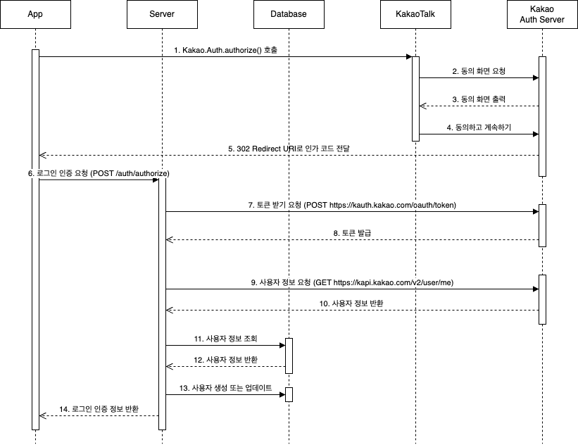

Spring Boot 환경에서 로그인 API 개발 과정에 대해 포스트를 작성합니다.   
클라이언트는 React 환경이며, 서버는 Spring Boot 환경으로 구성되어 클라이언트와 REST API 통신을 하고 있습니다.   
로그인 프로세스는 카카오 로그인을 연동하여 유저가 간편하게 로그인을 할 수 있도록 했으며, 클라이언트와 서버 간의 로그인된 사용자의 인증은 JWT 방식으로 진행했습니다.
이번 포스트에서는 [카카오 로그인 API](https://developers.kakao.com/docs/latest/ko/kakaologin/rest-api) 연동 개발 과정에 대해 설명하겠습니다.

카카오 로그인 REST API 문서를 참고하여 설계한 프로세스는 다음과 같습니다.



시퀀스 다이어그램 이미지에서 1 ~ 5번 구간은 클라이언트(앱)에서 유저가 카카오 로그인 버튼을 클릭하여 카카오톡 로그인을 진행하는 과정입니다.
유저가 로그인을 완료하면 카카오 인증 서버에서 클라이언트에게 code 값을 반환 합니다.
해당 code로 클라이언트는 서버의 로그인 인증 요청 API를 호출하여 자사의 서비스 로그인을 진행하게 됩니다. 
서버는 클라이언트에게 code를 전달받는 6번부터 로그인 프로세스 개발을 진행하면 됩니다.

해당 포스트에서는 시퀀스 다이어그램 6 ~ 13번의 로그인 프로세스 개발 과정을 설명하도록 하겠습니다.   
참고로 클라이언트에서 카카오 로그인 요청은 [JavaScript SDK를 이용한 간편로그인](https://developers.kakao.com/docs/latest/ko/kakaologin/js#login)을 이용합니다.
서버에서 [카카오 인가 코드를 받아오는 API](https://developers.kakao.com/docs/latest/ko/kakaologin/rest-api#request-code)를 개발하여 클라이언트가 호출하는 방식으로 진행할 수 있지만,
JavaScript SDK를 이용하면 유저가 모바일 웹 환경에서 직접 카카오 계정 정보 입력하는 과정을 거치지 않고, 카카오톡으로 간편하게 로그인을 할 수 있기 때문에 쾌적한 사용자 경험을 위해 JavaScript SDK 방식으로 결정했습니다.

---

개발 시작에 앞서 [Kakao developers](https://developers.kakao.com/) 사이트에 접속해서 몇가 지 설정을 진행해야 합니다.

1. 사이트에 접속하여 로그인 후, 내 애플리케이션 메뉴에서 애플리케이션을 추가해 주세요.
![[1] Kakao developers 애플리케이션 추가](images/kakao-my-application-add.png)

2. "내 애플리케이션 > 앱 설정 > 요약 정보" 메뉴에서 REST API 키를 확인해 주세요. (해당 정보는 서버에서 사용합니다.)
![[2] 내 애플리케이션 > 앱 설정 > 요약 정보 > REST API 키](images/kakao-rest-api-key.png)

3. "내 애플리케이션 > 앱 설정 > 플랫폼" 메뉴에서 Web 플랫폼 등록을 해주세요.   
   개발을 위해 서버 로컬 도메인을 입력해 주세요.
![[3] 내 애플리케이션 > 앱 설정 > 플랫폼 > Web 플랫폼 등록](images/kakao-add-web-platform.png)

4. "내 애플리케이션 > 제품 설정 > 카카오 로그인" 메뉴에서 활성화 상태를 ON으로 설정해 주세요.
![[4-1] 내 애플리케이션 > 제품 설정 > 카카오 로그인 > 활성화 상태 ON](images/kakao-login-on.png)

그리고 Redirect URI를 등록해 주세요. 개발을 위해 클라이언트 로컬 도메인을 입력해 주세요.   
유저가 카카오 로그인을 완료 후, 카카오 인증 서버에서 code를 전달받는 도메인입니다. (해당 정보는 서버에서 사용합니다.)
![[4-2] 내 애플리케이션 > 제품 설정 > 카카오 로그인 > Redirect URI 등록](images/kakao-add-redirect-uri.png)

5. "내 애플리케이션 > 제품 설정 > 카카오 로그인 > 동의항목" 메뉴에서 개인정보 항목의 상태를 필수 동의로 설정해 주세요.
![[5-1] 내 애플리케이션 > 제품 설정 > 카카오 로그인 > 동의항목 설정](images/kakao-agree-setting1.png)

기본적으로 닉네임과 프로필 사진 항목을 설정할 수 있으며, 비즈니스 인증을 하면 추가로 항목을 설정할 수 있습니다.   
"필수 동의" 항목은 카카오에서 필수로 정보를 전달받을 수 있고, "선택 동의 또는 이용 중 동의"는 사용자가 동의한 경우에 정보를 전달받을 수 있어요.
테스트를 위해 닉네임과 프로필 사진만 설정하도록 하겠습니다.
![[5-2] 내 애플리케이션 > 제품 설정 > 카카오 로그인 > 동의항목 설정 완료](images/kakao-agree-setting2.png)

6. "내 애플리케이션 > 제품 설정 > 카카오 로그인 > 보안" 메뉴에서 Client Secret 코드를 생성 후, 활성화 상태를 "사용함"으로 변경해 주세요. (해당 정보는 서버에서 사용합니다.)
![[6] 내 애플리케이션 > 제품 설정 > 카카오 로그인 > 보안 > Client Secret 생성](images/kakao-client-secret.png)

카카오 로그인 연동 개발을 위한 준비는 완료했습니다.

---

이제부터 카카오 로그인을 연동한 Login API 코드에 대한 설명을 시작하겠습니다.   
개발은 "Spring Boot 3.2.2 + Java(JDK 17) + Gradle" 환경에서 진행했습니다.   
자세한 코드 구성은 [깃허브](https://github.com/WHITEPAEK/demo-spring-boot-login-api) 예제 코드를 참고해 주세요.

- **클라이언트(앱)의 로그인 인증 요청을 처리하는 AuthController 코드입니다. (시퀀스 다이어그램 6 ~ 14)**
  - 카카오 인증 서버에 토큰 발급을 요청하는 API (시퀀스 다이어그램 7 ~ 8)
  - 카카오 인증 서버에 사용자 정보를 요청하는 API (시퀀스 다이어그램 9 ~ 10)
  - 카카오에서 조회한 사용자 인증을 처리하는 로직 (시퀀스 다이어그램 11 ~ 13)

```java
package com.whitepaek.api;

import com.jayway.jsonpath.ReadContext;
import com.whitepaek.api.request.AuthRequest;
import com.whitepaek.client.KakaoClient;
import com.whitepaek.service.AuthService;
import com.whitepaek.service.request.AuthServiceRequest;
import com.whitepaek.service.response.AuthResponse;
import lombok.RequiredArgsConstructor;
import org.springframework.http.ResponseEntity;
import org.springframework.web.bind.annotation.PostMapping;
import org.springframework.web.bind.annotation.RequestBody;
import org.springframework.web.bind.annotation.RestController;

@RequiredArgsConstructor
@RestController
public class AuthController {

    private final KakaoClient kakaoClient;
    private final AuthService authService;

    @PostMapping("/auth/authorize")
    public ResponseEntity<AuthResponse> authorize(@RequestBody AuthRequest authRequest) {

        ReadContext tokenAttributes = kakaoClient.getToken(authRequest.getCode()); // 카카오 인증 서버에 Token 발급 요청
        String accessToken = tokenAttributes.read("$.access_token");

        ReadContext userAttributes = kakaoClient.getUserInfo(accessToken); // 카카오 인증 서버에 로그인 사용자 정보 요청
        Long loginId = userAttributes.read("$.id");
        String nickname = userAttributes.read("$.kakao_account.profile.nickname");
        String profileImageUrl = userAttributes.read("$.kakao_account.profile.profile_image_url");

        AuthServiceRequest authServiceRequest = AuthServiceRequest.builder()
                .loginId(loginId)
                .nickname(nickname)
                .profileImageUrl(profileImageUrl)
                .build();
        AuthResponse authResponse = authService.authorizationProcess(authServiceRequest); // 로그인 사용자 인증 처리
        return ResponseEntity.ok(authResponse);
    }
}
```

- **카카오 REST API 요청을 위한 KakaoClient 코드입니다.**
  - getToken() 메서드는 [카카오 인증 서버에 토큰 발급을 요청하는 API](https://developers.kakao.com/docs/latest/ko/kakaologin/rest-api#request-token) 입니다. (시퀀스 다이어그램 7 ~ 8)
    - 요청
      - grant_type 파라미터의 값은 authorization_code로 고정입니다.
      - client_id 파라미터는 kakao developers 사이트의 "내 애플리케이션 > 앱 설정 > 앱 키" 메뉴에서 제공하는 REST API 키 입니다.
      - redirect_uri 파라미터는 kakao developers 사이트의 "내 애플리케이션 > 제품 설정 > 카카오 로그인" 메뉴에서 등록한 Redirect URI 입니다.
      - code 파라미터는 클라이언트(앱)에서 전달받은 code 입니다.
      - client_secret 파라미터는 kakao developers 사이트의 "내 애플리케이션 > 제품 설정 > 카카오 로그인 > 보안" 메뉴에서 생성한 Client Secret 코드입니다.
    - 응답
      - 응답 JSON에서 사용자 정보 조회를 위한 access_token 값만 필요합니다.
  - getUserInfo() 메서드는 [카카오 인증 서버에 사용자 정보를 요청하는 API](https://developers.kakao.com/docs/latest/ko/kakaologin/rest-api#req-user-info) 입니다. (시퀀스 다이어그램 9 ~ 10)
    - 요청
      - 카카오 인증 서버에서 발급받은 access_token을 헤더에 넣어서 요청합니다.
    - 응답
      - 응답 JSON에서 "id, kakao_account" 값만 필요합니다.
      - id는 카카오 로그인 사용자의 고유한 식별 값입니다.

```java
package com.whitepaek.client;

import com.jayway.jsonpath.JsonPath;
import com.jayway.jsonpath.ReadContext;
import lombok.extern.slf4j.Slf4j;
import org.springframework.beans.factory.annotation.Value;
import org.springframework.http.MediaType;
import org.springframework.stereotype.Component;
import org.springframework.util.LinkedMultiValueMap;
import org.springframework.util.MultiValueMap;
import org.springframework.web.client.RestClient;

import java.util.Map;

@Slf4j
@Component
public class KakaoClient {

    private static final String AUTHORIZATION_GRANT_TYPE = "authorization_code";
    private static final String TOKEN_URI = "https://kauth.kakao.com/oauth/token";
    private static final String USER_INFO_URI = "https://kapi.kakao.com/v2/user/me";

    private final String clientId;
    private final String clientSecret;
    private final String redirectUri;

    private KakaoClient(
            @Value("${kakao.client-id}") String clientId,
            @Value("${kakao.client-secret}") String clientSecret,
            @Value("${kakao.redirect-uri}") String redirectUri
    ) {
        this.clientId = clientId;
        this.clientSecret = clientSecret;
        this.redirectUri = redirectUri;
    }

    /**
     * 카카오 토큰 발급 API
     * Ref. https://developers.kakao.com/docs/latest/ko/kakaologin/rest-api#request-token
     * @param code
     * @return
     */
    public ReadContext getToken(String code) {
        MultiValueMap<String, Object> params = new LinkedMultiValueMap<>();
        params.add("grant_type", AUTHORIZATION_GRANT_TYPE);
        params.add("client_id", clientId);
        params.add("redirect_uri", redirectUri);
        params.add("code", code);
        params.add("client_secret", clientSecret);
        var responseBody = RestClient.builder().build()
                .post()
                .uri(TOKEN_URI)
                .contentType(MediaType.APPLICATION_FORM_URLENCODED)
                .body(params)
                .retrieve()
                .body(Map.class);
        return JsonPath.parse(responseBody);
    }

    /**
     * 카카오 로그인 사용자 정보 조회 API
     * Ref. https://developers.kakao.com/docs/latest/ko/kakaologin/rest-api#req-user-info
     * @param accessToken
     * @return
     */
    public ReadContext getUserInfo(String accessToken) {
        var responseBody = RestClient.builder().build()
                .get()
                .uri(USER_INFO_URI)
                .header("Authorization", "Bearer " + accessToken)
                .retrieve()
                .body(Map.class);
        return JsonPath.parse(responseBody);
    }
}

```

"client-id, client-secret, redirect-uri" 정보는 application.yml 파일에 정의해 주세요.

```yml
kakao:
   client-id: bd378af8980a4744c2d2549b9a53329b # REST API 키
   client-secret: q0tg1TIEOKhhj99syFZQk52xwHsHVWul # Client Secret
   redirect-uri: http://localhost:3000/oauth/code/kakao # Redirect URI
```

- **카카오 인증 서버에서 조회한 사용자 정보로 로그인 인증 처리를 하는 AuthService 코드입니다. (시퀀스 다이어그램 11 ~ 13)**
  - 카카오 인증 서버에서 조회한 사용자 아이디(id)와 로그인 타입으로 멤버를 조회합니다.
  - 기존 멤버가 존재하는 경우, 닉네임과 프로필 이미지를 업데이트합니다.
  - 신규 멤버인 경우, 사용자 아이디, 닉네임, 프로필 이미지 정보로 멤버를 생성합니다.

```java
package com.whitepaek.service;

import com.whitepaek.entity.Member;
import com.whitepaek.repository.MemberRepository;
import com.whitepaek.service.request.AuthServiceRequest;
import com.whitepaek.service.response.AuthResponse;
import lombok.RequiredArgsConstructor;
import org.springframework.stereotype.Service;

import java.util.Optional;

@RequiredArgsConstructor
@Service
public class AuthService {

    private final MemberRepository memberRepository;

    public AuthResponse authorizationProcess(AuthServiceRequest authServiceRequest) {
        Optional<Member> optionalMember = memberRepository.findByLoginTypeAndLoginId(authServiceRequest.getLoginType(), authServiceRequest.getLoginId());
        Member member;

        if (optionalMember.isPresent()) {
            // 기존 멤버
            member = optionalMember.get();
            member.login(authServiceRequest.getNickname(), authServiceRequest.getProfileImageUrl());
        } else {
            // 신규 멤버
            member = authServiceRequest.toEntity();
            memberRepository.save(member);
        }

        return AuthResponse.builder()
                .id(member.getId())
                .nickname(member.getNickname())
                .profileImageUrl(member.getProfileImageUrl())
                .build();
    }
}
```

---

서버의 로그인 API가 정상적으로 동작하는지 확인해 보겠습니다.

1. 아래 URL을 참고하여 client_id, redirect_uri, response_type을 넣은 후 브라우저에서 요청하면 code를 발급받을 수 있습니다.
   response_type은 code로 고정이며, client_id와 redirect_uri는 kakao developers 사이트에서 값을 가져와서 넣어주세요.

```text
https://kauth.kakao.com/oauth/authorize?client_id=bd378af8980a4744c2d2549b9a53329b&redirect_uri=http://localhost:3000/oauth/code/kakao&response_type=code
```

2. 브라우저에서 API를 요청하면 URL 쿼리 스트링으로 code 값을 받을 수 있습니다. code 값을 복사해 주세요.

![[2] URL Query String으로 code 값 반환](./images/kakao-code.png)

3. 서버를 실행하고, Postman과 같은 툴로 "POST localhost:8080/auth/authorize" API를 요청해 주세요.   
   저는 IntelliJ IDEA에서 http 디렉터리 하위에 auth.http 파일을 생성하여 진행했습니다.   
   auth.http 파일에 code 값을 넣고 요청하면 200 응답 코드와 함께 결과 파일(2024-03-13T044114.200.json)을 받을 수 있습니다.
![[3] POST http://localhost:8080/auth/authorize API 호출](./images/kakao-login-api-test.png)

4. 응답 결과를 확인하면 정상적으로 응답 데이터를 받은 걸 확인할 수 있습니다.

```json
{
  "id": 1,
  "nickname": "whitepaek",
  "profileImageUrl": "http://t1.kakaocdn.net/account_images/default_profile.jpeg.twg.thumb.R640x640"
} 
```

이번 포스트에서는 카카오 로그인 연동에 대한 로그인 프로세스를 알아봤습니다.
카카오 공식 문서를 참고하여 카카오 로그인 연동에 큰 어려움이 없었습니다.
다음 포스트에서는 이번 포스트에서 구현한 로그인 API에 JWT 방식을 적용하여 클라이언트와 서버 간의 인증 처리를 진행하겠습니다.